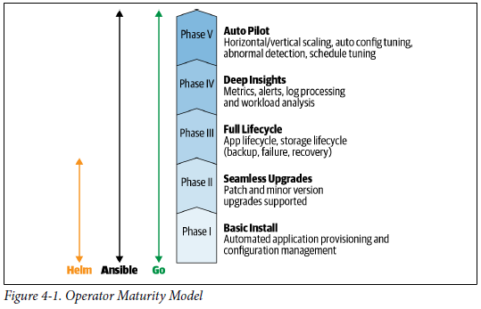

# Chapter 4: The Operator Framework

* Make it simpler to create and distribute Operators
* Provides mechanisms for deploying and managing Operators
* **The Red Hat Operator Framework**
  * **[Operator SDK](https://github.com/operator-framework/operator-sdk)**: automates much of the repetitive implementation work
  * **[Operator Lifecycle Manager (OLM)](https://github.com/operator-framework/operator-lifecycle-manager)**: Operator that installs, manages, and upgrades other Operators
  * **[Operator Metering](https://github.com/operator-framework/operator-metering)**: a metrics system that accounts for Operators’ use of cluster resources

## Operator Framework Origins

* builds atop [Kubernetes controller-runtime](https://github.com/kubernetes-sigs/controller-runtime)

  * `Kubernetes controller-runtime`: set of libraries providing essential Kubernetes controller routines in the Go programming language

  

## Operator Maturity Model

> [Maturity](https://en.dict.naver.com/#/entry/enko/3e16b2b7f21540f89ec65e48d68797c2): 성숙함, 원숙함

* **Phase I: Basic Install**
  * Automated application provisioning and configuration management
* **Phase II: Seamless Upgrades**
  * Patch and minor version upgraded supported
* **Phase III: Full Lifecycle**
  * App lifecycle, storage lifecycle (backup, failure, recovery)
* **Phase IV: Deep Insights**
  * Metrics, alerts, log processing and workload analysis
* **Phase V: Auto Pilot**
  * Horizontal/Vertical Scaling, auto config tuning, abnormal detection, schedule tuning

## Operator SDK

* A set of tools for scaffolding, building, and preparing an Operator for deployment

  > [scaffolding](https://terms.naver.com/entry.nhn?docId=1105751&cid=40942&categoryId=32337): 비계, 건축공사 때에 높은 곳에서 일할 수 있도록 설치하는 임시가설물

  

## Installing the Operator SDK Tool

* Command-line tool: `operator-sdk`
* Imposes a standard project layout
* Creates skeletal Go source code for the basic Kubernetes API controller implementation and placeholders for your application-specific handlers
* provides convenience commands for building an Operator and wrapping it in a Linux
  container
  * generating the YAML-format Kubernetes manifests needed to deploy the Operator on Kubernetes clusters

>  [Install the Operator SDK CLI](https://github.com/operator-framework/operator-sdk/blob/master/doc/user/install-operator-sdk.md)

## Operator Lifecycle Manager

* Operators address the general principle that any application, on any platform, must
  be acquired, deployed, and managed over time.

* Operators are themselves Kubernetes applications

* Operator Lifecycle Manager (**OLM**)

  * Operator that acquires, deploys, and manages Operators on a Kubernetes cluster
  * defines a schema for Operator metadata, called the Cluster Service Version (CSV)
    * `CSV`: for describing an Operator and its dependencies

* Operators with a CSV **can be listed as entries in a catalog** available to OLM running on a Kubernetes cluster

* Users then *subscribe* to an Operator from the catalog to tell OLM to provision and manage a desired Operator

* That Operator, in turn, provisions and manages its application or service on the cluster

* Based on the description and parameters an Operator provides in its CSV, OLM can
  manage the Operator over its lifecycle

  * monitoring its state, taking actions to keep it running, coordinating among multiple instances on a cluster, and upgrading it to new versions

  

## Operator Metering

* **A system for analyzing the resource usage of the Operators** running on Kubernetes clusters
  * Kubernetes CPU, memory, and other resource metrics to calculate costs for infrastructure services
  * Application-specific metrics, such as those required to bill application users based on usage
* Provides a model for ops teams to map the costs of a cloud service or a cluster resource to the application, namespace, and team consuming it
* platform atop which you can build customized reporting specific to your Operator and
  the application it manages, helping with three primary activities:
  * **Budgeting**
  * **Billing**
  * **Metrics aggregation**